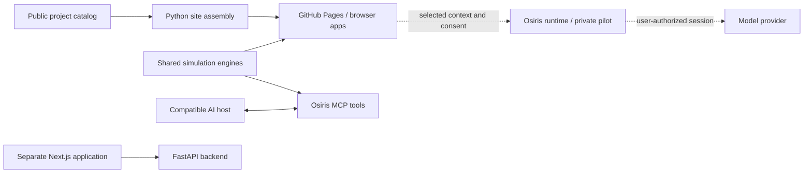

# Ballzatram

**Applied AI, decision tools, and interactive systems.**

An independent software lab by **Devin Gallemore**. Ballzatram turns complex systems into things people can explore: economic simulations, source-backed research workspaces, and an AI companion that works with explicitly selected context.

[Explore the site](https://dgallemore.com/) · [Portfolio](https://dgallemore.com/devin/) · [Engineering tour](docs/ENGINEERING_TOUR.md) · [Run locally](docs/DEVELOPMENT.md)

<br clear="right" />

[](https://github.com/Ballzatram/ballzatram/actions/workflows/deploy-pages.yml)
[](https://github.com/Ballzatram/ballzatram/actions/workflows/docs.yml)

## The idea

Make the underlying system visible. A learner should be able to change a decision and understand the consequence. A researcher should be able to trace a finding back to its source. An AI integration should make clear what context it receives, what it can do, and who pays for inference.

The public site is a **static-first portfolio and working lab**, not a claim that every experiment is a production service. Browser-native projects work independently of the optional AI and backend services.

## Selected projects

| Project | What it does | Where to start |
| --- | --- | --- |
| **Osiris** | Connects selected project context to AI workflows. Shared deterministic tools run inside compatible AI hosts; a separate runtime explores in-page, user-authorized conversation. | [Tools service](osiris-tools/README.md) · [Runtime pilot](osiris-runtime/README.md) |
| **The Family Business / Econ Arcade** | Teaches economics through decisions, controlled experiments, and a persistent campaign. Shared engines keep simulation outcomes separate from AI explanations. | [Play the campaign](https://dgallemore.com/econ-arcade/play/) · [Design and mechanics](docs/family-business.md) |
| **Congressional Accountability** | A bill-research workbench with source snapshots, version comparisons, local watchlists, and explicit evidence gaps. | [Open the workbench](https://dgallemore.com/tools/observatory/) · [Sources and limitations](docs/observatory/WORKBENCH.md) |
| **Parcel** | Organizes land-search briefs, sourced candidates, comparisons, and diligence exports. Model-assisted research is an optional runtime-dependent path. | [Open Parcel](https://dgallemore.com/tools/parcel/) · [Project guide](tools/parcel/README.md) |

The repository also includes a **Next.js / FastAPI quantitative research application**, a learning-feed experiment, and earlier creative prototypes. The [documentation index](docs/README.md) separates current implementation guides from proposals and historical audits.

## What to review in the code

- **Shared domain logic:** the website and Osiris tools reuse simulation engines rather than asking a model to calculate authoritative game outcomes. Start with [Supply & Demand](tools/supply-demand/engine.js) and the [campaign engine](econ-arcade/play/campaign-engine.js).
- **Explicit AI boundaries:** feature-specific context, consent checks, session handling, cancellation, and a constrained runtime protocol. Start with the [runtime server](osiris-runtime/server.mjs) and its [tests](osiris-runtime/test/runtime.test.mjs).
- **Evidence-aware research:** bounded ingestion, retained source snapshots, freshness labels, and distinctions between official records and personal interpretations. Start with the [Observatory workbench guide](docs/observatory/WORKBENCH.md) and [refresh pipeline](scripts/refresh_observatory.py).

For a guided review of the problem, implementation, tests, and tradeoffs, read the [engineering tour](docs/ENGINEERING_TOUR.md).

## Architecture at a glance



**These are separate deployment surfaces.** GitHub Pages serves the browser applications; it does not run Next.js server features, FastAPI, or the persistent Osiris runtime. The MCP service runs tools inside a compatible AI host, while the runtime pilot is the distinct in-page conversation path. See [deployment](DEPLOYMENT.md) and the [AI integration guide](docs/bring-your-own-ai.md).

## Run the public site locally

Use **Python 3.12**, matching the repository's Python CI. No Node installation, provider account, or API key is needed for this static preview.

```sh
git clone https://github.com/Ballzatram/ballzatram.git
cd ballzatram
python scripts/build_public.py
python -m http.server 8080 --bind 127.0.0.1 --directory _site
```

Open **http://127.0.0.1:8080/**. The assembly script recreates `_site/` from the explicit publication manifest; it does not start backend services. Stop the preview with `Ctrl+C`.

For the Next.js / FastAPI application, Osiris services, and focused test suites, use the [development guide](docs/DEVELOPMENT.md).

## Verification

Run the lightweight documentation and public-site checks from the repository root:

```sh
python scripts/validate_docs.py
python scripts/validate_lab_readiness.py
python scripts/validate_public.py
```

[PR Validation](.github/workflows/pr-validation.yml) also runs backend tests, frontend static regressions, TypeScript checks and a build, Observatory checks, and runtime protocol/container checks. The [Osiris tools](.github/workflows/osiris-tools.yml) and [learning-feed](.github/workflows/osiris-feed.yml) workflows cover their own surfaces. The frontend command named `lint` currently performs **type generation and TypeScript checking**, not a general-purpose lint pass.

Badges link to actual workflow runs. Passing automated checks is not proof of live provider sign-in, hosted-service activation, current external data, or user-account acceptance.

## Current boundaries

**Runnable browser experiences:** the campaign, simulations, and research workspaces. Some use retained public data or browser-local saves; availability and freshness are shown by each project.

**Optional services:** Next.js / FastAPI require their own runtime. Osiris MCP requires deployment and host installation. The in-page subscription runtime is an invitation-only pilot; a running host and user-completed acceptance are required. The runtime guide records that development did not complete a live subscription sign-in or model answer. No universal subscription API or cross-provider compatibility is implied.

**Not a production claim:** quantitative examples are research/demo workflows; teaching indicators are not calibrated policy estimates; source-backed candidates are not verified acquisitions. Public billing, durable multi-user workspaces, and broader AI activation remain separate work. Older monetization and scaling documents are proposals, not shipped capabilities.

## Documentation and contribution

[Documentation index](docs/README.md) · [Engineering tour](docs/ENGINEERING_TOUR.md) · [Development](docs/DEVELOPMENT.md) · [Contributing](CONTRIBUTING.md) · [Security](SECURITY.md)

This is independent, AI-assisted portfolio work. The [contribution guide](CONTRIBUTING.md) describes review expectations, evidence standards, and licensing status. Existing project identities, experiments, and third-party notices are retained.
